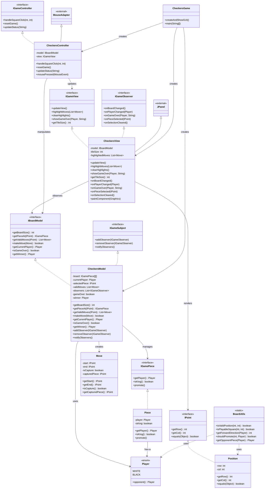

# Checkers Project Inheritance Diagram

```mermaid
classDiagram
    %% Interfaces
    class IPoint {
        <<interface>>
        +getRow() int
        +getCol() int
        +equals(Object) boolean
    }

    class IGamePiece {
        <<interface>>
        +getPlayer() Player
        +isKing() boolean
        +promote()
    }

    class IGameObserver {
        <<interface>>
        +onBoardChanged()
        +onPlayerChanged(Player)
        +onGameOver(Player, String)
        +onPieceSelected(IPoint)
        +onSelectionCleared()
    }

    class IGameSubject {
        <<interface>>
        +addObserver(IGameObserver)
        +removeObserver(IGameObserver)
        +notifyObservers()
    }

    class IBoardModel {
        <<interface>>
        +getBoardSize() int
        +getPieceAt(IPoint) IGamePiece
        +getValidMoves(IPoint) List~Move~
        +makeMove(Move) boolean
        +getCurrentPlayer() Player
        +isGameOver() boolean
        +getWinner() Player
    }

    class IGameView {
        <<interface>>
        +updateView()
        +highlightMoves(List~Move~)
        +clearHighlights()
        +showGameOver(Player, String)
        +getTileSize() int
    }

    class IGameController {
        <<interface>>
        +handleSquareClick(int, int)
        +resetGame()
        +updateStatus(String)
    }

    %% Data Classes & Enums
    class Player {
        <<enum>>
        WHITE
        BLACK
        +opponent() Player
    }

    class Position {
        -row: int
        -col: int
        +getRow() int
        +getCol() int
        +equals(Object) boolean
    }

    class Move {
        -start: IPoint
        -end: IPoint
        -isCapture: boolean
        -capturedPiece: IPoint
        +getStart() IPoint
        +getEnd() IPoint
        +isCapture() boolean
        +getCapturedPiece() IPoint
    }

    class Piece {
        -player: Player
        -isKing: boolean
        +getPlayer() Player
        +isKing() boolean
        +promote()
    }

    %% External Classes
    class JPanel {
        <<external>>
    }

    class MouseAdapter {
        <<external>>
    }

    %% Implementations
    class CheckersModel {
        -board: IGamePiece[][]
        -currentPlayer: Player
        -selectedPiece: IPoint
        -validMoves: List~Move~
        -observers: List~IGameObserver~
        -gameOver: boolean
        -winner: Player
        +getBoardSize() int
        +getPieceAt(IPoint) IGamePiece
        +getValidMoves(IPoint) List~Move~
        +makeMove(Move) boolean
        +getCurrentPlayer() Player
        +isGameOver() boolean
        +getWinner() Player
        +addObserver(IGameObserver)
        +removeObserver(IGameObserver)
        +notifyObservers()
    }

    class CheckersView {
        -model: IBoardModel
        -tileSize: int
        -highlightedMoves: List~Move~
        +updateView()
        +highlightMoves(List~Move~)
        +clearHighlights()
        +showGameOver(Player, String)
        +getTileSize() int
        +onBoardChanged()
        +onPlayerChanged(Player)
        +onGameOver(Player, String)
        +onPieceSelected(IPoint)
        +onSelectionCleared()
        +paintComponent(Graphics)
    }

    class CheckersController {
        -model: IBoardModel
        -view: IGameView
        +handleSquareClick(int, int)
        +resetGame()
        +updateStatus(String)
        +mousePressed(MouseEvent)
    }

    class BoardUtils {
        <<static>>
        +isValidPosition(int, int) boolean
        +isPlayableSquare(int, int) boolean
        +getForwardDirection(Player) int
        +shouldPromote(int, Player) boolean
        +getOpponentPiece(Player) Player
    }

    class CheckersGame {
        +createAndShowGUI()
        +main(String[])
    }

    %% Relationships
    IPoint <|.. Position
    IGamePiece <|.. Piece
    IBoardModel <|.. CheckersModel
    IGameSubject <|.. CheckersModel
    IGameView <|.. CheckersView
    IGameObserver <|.. CheckersView
    IGameController <|.. CheckersController

    JPanel <|-- CheckersView
    MouseAdapter <|-- CheckersController

    CheckersModel --> Player: uses
    CheckersModel --> IGamePiece: manages
    CheckersModel --> Move: creates

    Piece --> Player: has-a

    CheckersView --> IBoardModel: observes
    CheckersView --> IPoint: renders

    CheckersController --> IBoardModel: manipulates
    CheckersController --> IGameView: updates

    CheckersGame --> CheckersModel: creates
    CheckersGame --> CheckersView: creates
    CheckersGame --> CheckersController: creates

    BoardUtils ..> Position: uses
    BoardUtils ..> Player: uses
```
